# ENVANTER YÖNETİM SİSTEMİ

## Basit, Etkili ve Kullanıcı Dostu Envanter Yönetimi

Bu sistem, işletmelerin veya bireysel kullanıcıların ürünlerini etkili bir şekilde yönetmesini sağlar. Yönetici ve kullanıcı olmak üzere iki farklı rol sunarak, yetkilendirilmiş işlemleri kolayca yapmanıza olanak tanır.

- **Yönetici olarak**, ürün ekleme, güncelleme, silme ve kullanıcı yönetimi gibi tüm işlemleri gerçekleştirebilirsiniz.
- **Kullanıcı olarak**, ürünleri görüntüleyebilir ve raporlar alabilirsiniz.

Karmaşık işlemleri kolaylaştıran, kullanıcı dostu bir arayüze sahip olan bu sistem, işletmenizin verimliliğini artırmayı hedefler. Kullanıcı giriş ekranından ürün raporlarına kadar her şey basit ve anlaşılır bir şekilde tasarlanmıştır.

Bu proje aşağıdaki dosya ve klasörlerden oluşmaktadır:

###  **`ana_menu.sh`**
-  Uygulamanın ana çalıştırma dosyasıdır. Kullanıcı girişinden başlayarak ana menüyü ve tüm işlemleri yönetir.
- **İçerdiği İşlevler:**
  - Kullanıcı girişi
  - Yönetici ve kullanıcı işlemleri
  - Ürün ekleme, silme, güncelleme
  - Kullanıcı yönetimi ve şifre sıfırlama
  - Program yönetimi (yedekleme ve hata kayıtlarını görüntüleme)
 
###  **`kullanici.csv`**
-  Sistemdeki kullanıcı bilgilerini saklar.
- **İçerik Formatı:**
  ```csv
  kullanici_id,kullanici_adi,rol,sifre
  1,admin,yönetici,5f4dcc3b5aa765d61d8327deb882cf99
  2,user1,kullanıcı,5f4dcc3b5aa765d61d8327deb882cf99

### **`depo.csv`**
-  Sistemde yer alan ürün bilgilerinin saklandığı dosyadır. Ürünlerle ilgili tüm işlemler (ekleme, güncelleme, silme) bu dosya üzerinden gerçekleştirilir.
- **Kullanımı:** 
  - Yeni ürünler eklendiğinde, ürün bilgileri bu dosyaya yazılır.
  - Ürün güncelleme işlemlerinde ilgili satır bu dosyada değiştirilir.
  - Ürün silindiğinde, ilgili ürün bu dosyadan kaldırılır.
- **İçerik Formatı:**
  ```csv
  urun_id,urun_adi,stok_miktari,fiyat,kategori
  1,Kalem,100,2.5,Kırtasiye
  2,Defter,200,5.0,Kırtasiye

### **`log.csv`** 
  - **log.csv**, sistemde gerçekleşen hataların ve önemli olayların kaydedildiği bir dosyadır. Özellikle hata tespiti ve geçmişteki olayları izlemek için kullanılır. 
  - Kullanıcıların hatalı giriş denemeleri, ürün işlemleri sırasında oluşan hatalar ve kilitli hesaplarla ilgili kayıtlar bu dosyada saklanır.
- **Kullanımı:**
  - Her hata veya önemli olay gerçekleştiğinde, ilgili bilgi bu dosyaya bir satır olarak eklenir.
  - Yönetici, "Hata Kayıtlarını Görüntüle" seçeneğiyle bu dosyanın içeriğini inceleyebilir.
  
- **İçerik Formatı:**
  ```csv
  hata_no,tarih,saat,kullanici,hata_mesaji,urun_bilgisi
  1,2024-12-29,15:45:10,user1,Hatalı şifre girildi,Yok
  2,2024-12-29,15:50:00,admin,Ürün güncelleme hatası,Kalem


## Kurulum ve Başlangıç

Bu bölümde, **Envanter Yönetim Sistemi**'ni çalıştırmak için gereken adımlar açıklanmıştır. Aşağıdaki adımları izleyerek uygulamayı sisteminizde kolayca çalıştırabilirsiniz.

### 1. Sistem Gereksinimleri
Uygulamanın çalışması için aşağıdaki yazılımların sisteminizde yüklü olması gerekmektedir:
- **Bash Shell** (Linux/Unix tabanlı sistemler için varsayılan)
- **Zenity** (Grafik kullanıcı arayüzü bileşenlerini göstermek için)
- **`md5sum`** komutu (şifreleme için)

#### Zenity Yükleme
-  Zenity yüklü değilse aşağıdaki komut ile yükleyebilirsiniz:
     ```bash
     sudo apt install zenity


#### Uygulama Dosyaların İndirme
- git clone https://github.com/Kutibios/ZenityileEnvanterYonetimi.git
- cd ZenityileEnvanterYonetimi

#### Çalıştırma İzni Verin
- chmod +x ana_menu.sh

### Uygulamayı Başlatın
- ./ana_menu.sh

## NOT 
Varsayılan yönetici kullanıcı adı ve şifresi:

    Kullanıcı Adı: root
    Şifre: 1234

    
## Uygulama Kullanımı ve Ekran Görüntüleri

Bu bölümde, uygulamanın adım adım nasıl kullanılacağını ekran görüntüleriyle birlikte açıklıyoruz. Her bir görsel, uygulamanın farklı bir özelliğini ve kullanım şeklini göstermektedir.

### Giriş Ekranı

Uygulamayı başlattığınızda karşınıza bu giriş ekranı gelir. Burada:

- **Kullanıcı Adı**: Sisteme giriş yapmak için kullanıcı adınızı yazmanız gereken alan.
- **Şifre**: Sisteme giriş yapmak için şifrenizi yazmanız gereken alan.
- Giriş bilgilerinizi doğru bir şekilde girdikten sonra, ana menüye yönlendirilirsiniz. Eğer bilgileriniz hatalıysa, sistem size hata mesajı gösterir.


<div align="center">
  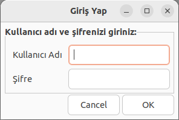
</div>

### Giriş Başarılı Mesajı

Başarılı bir giriş yaptığınızda karşınıza bu bilgi mesajı gelir. Bu mesaj, sisteme başarılı bir şekilde giriş yaptığınızı ve hangi rolde olduğunuzu belirtir.

<div align="center">
  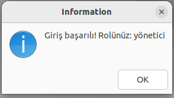
</div>

### Ana Menü

Giriş yaptıktan sonra, kullanıcı rolüne göre **Ana Menü** ekranı karşınıza gelir. Yönetici rolüyle giriş yaptığınızda, aşağıdaki seçeneklere erişebilirsiniz:

- **Ürün Ekle**: Yeni ürün eklemek için bu seçeneği kullanabilirsiniz.
- **Ürün Güncelle**: Mevcut bir ürünün bilgilerini güncelleyebilirsiniz.
- **Ürün Sil**: İlgili ürünü envanterden kaldırabilirsiniz.
- **Ürün Listele**: Sistemde kayıtlı olan tüm ürünleri listeleyebilirsiniz.
- **Rapor Al**: Stok durumu veya yüksek stok miktarına göre raporlar alabilirsiniz.
- **Şifre Sıfırla**: Kullanıcıların şifrelerini sıfırlamak için bu seçeneği kullanabilirsiniz.
- **Kilitli Hesabı Aç**: Üç kez hatalı şifre nedeniyle kilitlenen hesapları açabilirsiniz.
- **Hesapları Kontrol Et**: Kilitli hesapları listelemek ve kontrol etmek için kullanılır.
- **Kullanıcı Yönetimi**: Yeni kullanıcı ekleme, mevcut kullanıcıları güncelleme veya silme işlemleri yapılabilir.
- **Program Yönetimi**: Sisteme ait yedekleme, disk alanı görüntüleme ve hata kayıtlarını inceleme işlemleri için kullanılır.
- **Çıkış**: Programdan çıkış yapmak için bu seçeneği kullanabilirsiniz.


<div align="center">
  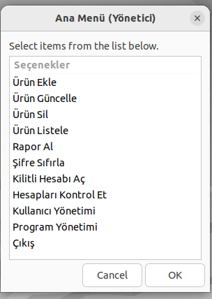
</div>

**Not:**
- Yönetici rolüne sahip kullanıcılar tüm bu seçeneklere erişebilir.
- Eğer "kullanıcı" rolünde giriş yapmışsanız, yalnızca **Ürün Listele** ve **Rapor Al** seçeneklerini kullanabilirsiniz. Diğer seçeneklere tıklarsanız "Bu işlem için yetkiniz yok" uyarısı alırsınız.

### Ürün Ekle

Bu ekran, sisteme yeni bir ürün eklemek için kullanılır. Yönetici olarak giriş yaptığınızda **Ana Menü** üzerinden **Ürün Ekle** seçeneğini seçerek bu ekrana ulaşabilirsiniz.

#### Form Alanları:
1. **Ürün Adı**: Eklemek istediğiniz ürünün adı. Örneğin, "elma".
2. **Stok Miktarı**: Ürünün başlangıç stok miktarı. Örneğin, "12".
3. **Fiyat**: Ürünün birim fiyatı. Örneğin, "5.78".
4. **Kategori**: Ürünün kategorisi. Örneğin, "meyve".


<div align="center">
  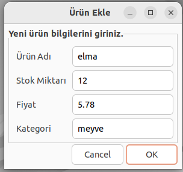
</div>

#### Notlar:
- Girdiğiniz bilgilerin doğru olduğundan emin olun. 
- **Ürün Adı** boşluk içeremez ve benzersiz olmalıdır (sistemde aynı isimde başka bir ürün bulunmamalıdır).
- Stok miktarı ve fiyat yalnızca pozitif sayı olmalıdır (0 dahil).
- Eğer yanlış veya eksik bilgi girilirse sistem uyarı verir ve ekleme işlemi tamamlanmaz.

Bu ekran sayesinde yeni ürünler hızlı ve kolay bir şekilde sisteme eklenebilir.
#### Ürün Eklendi Mesajı
<div align="center">
  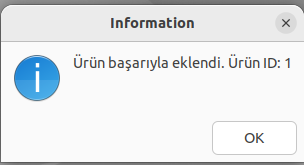
</div>

### Envanter Listesi

Bu ekran, sisteme kayıtlı tüm ürünlerin listesini görüntülemek için kullanılır. **Ana Menü** üzerinden **Ürün Listele** seçeneğini seçerek bu ekrana ulaşabilirsiniz.

#### Görsel Açıklaması:
- **ID**: Her ürün için benzersiz bir kimlik numarasıdır. Sistem tarafından otomatik olarak atanır.
- **Ürün Adı**: Ürünün adı. Örneğin, "elma".
- **Stok**: Ürünün mevcut stok miktarı. Örneğin, "12".
- **Fiyat**: Ürünün birim fiyatı. Örneğin, "5".


#### Kullanım:
1. **Listeyi Görüntülemek:** Sisteme kayıtlı tüm ürünleri tablo formatında gösterir.
2. **Bilgi Kontrolü:** Stok ve fiyat gibi bilgilerin doğruluğunu kontrol etmek için kullanılabilir.
3. **Yönetim Kolaylığı:** Yönetici ve kullanıcıların envanteri hızlıca görüntülemesini sağlar.


<div align="center">
  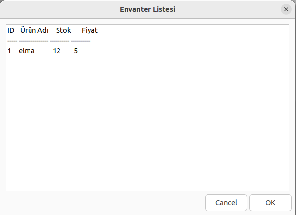
</div>

#### Notlar:
- Bu ekran yalnızca ürünleri listelemek içindir, ürün üzerinde işlem yapmayı desteklemez.
- Eğer sistemde kayıtlı hiçbir ürün yoksa, liste boş olarak görüntülenir.
- Ürün bilgileri doğrudan `depo.csv` dosyasından alınır.

Bu ekran sayesinde envanterdeki ürünlerin hızlı ve kolay bir şekilde görüntülenmesi sağlanır.
### Rapor Al

Bu ekran, envanterdeki ürünler hakkında rapor almak için kullanılır. **Ana Menü** üzerinden **Rapor Al** seçeneğini seçerek bu ekrana ulaşabilirsiniz.

#### Seçenekler:
1. **Stokta Azalan Ürünler**:
   - Belirli bir eşik değerinin altındaki ürünlerin listesini görmek için bu seçeneği kullanabilirsiniz.
   - Örneğin, stok miktarı "5"ten az olan ürünler raporlanır.

2. **En Yüksek Stok Miktarına Sahip Ürünler**:
   - Belirli bir eşik değerinin üstündeki ürünlerin listesini görmek için bu seçeneği kullanabilirsiniz.
   - Örneğin, stok miktarı "20"den fazla olan ürünler raporlanır.


<div align="center">
  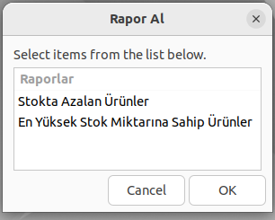
</div>

#### Notlar:
- Eşik değeri istenen formatta (örneğin pozitif bir sayı) girilmelidir.
- Eğer sistemde eşik değerine uygun ürün yoksa, rapor boş olarak görüntülenir.
- Bu özellik hem yönetici hem de kullanıcı tarafından kullanılabilir.

Bu ekran, envanterdeki ürünler hakkında hızlı ve etkili bir şekilde rapor almanızı sağlar.
### En Yüksek Stok Miktarına Sahip Ürünler Raporu

Bu ekran, en yüksek stok miktarına sahip ürünlerin raporunu görüntüler. **Rapor Al** menüsünden "En Yüksek Stok Miktarına Sahip Ürünler" seçeneği seçildiğinde ve eşik değeri girildiğinde bu ekran karşınıza gelir.

#### Görsel Açıklaması:
- **Başlıklar**:
  - `urun_id`: Ürünün benzersiz kimlik numarası.
  - `urun_adi`: Ürünün adı. Örneğin, "elma".
  - `stok_miktari`: Ürünün stok miktarı. Örneğin, "8".
  - `fiyat`: Ürünün birim fiyatı.
  - `kategori`: Ürünün ait olduğu kategori.
- **İçerik**: Eşik değeri aşılan ürünler burada gösterilir.

<div align="center">
  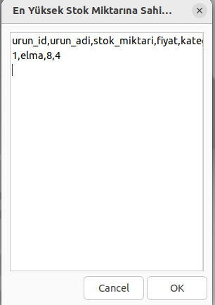
</div>

#### Notlar:
- Rapor sadece eşik değerine uygun ürünleri gösterir.
- Eğer eşik değerine uygun ürün yoksa, ekran boş olarak görüntülenir.
- Bu ekran yalnızca raporu görüntülemek içindir, ürün üzerinde işlem yapılamaz.

Bu ekran, envanterdeki ürünler arasında yüksek stok miktarına sahip ürünleri hızlıca belirlemenize olanak tanır.

### Kilitli Hesaplar

Bu ekran, sistemde yanlış şifre denemeleri nedeniyle kilitlenen hesapları görüntülemek için kullanılır. **Ana Menü** üzerinden **Kilitli Hesabı Aç** veya **Hesapları Kontrol Et** seçeneği seçildiğinde karşınıza gelir.


- **Kullanıcı Adı**: Kilitlenmiş olan kullanıcıların adları burada listelenir. Örneğin, "admin".
- Liste, yanlış şifre nedeniyle kilitlenmiş tüm kullanıcı hesaplarını gösterir.


#### Kullanım:
1. Kilitlenmiş bir hesap varsa, bu ekran aracılığıyla kullanıcı adını görebilirsiniz.
2. Yönetici, kilitli bir hesabı seçip **Kilitli Hesabı Aç** seçeneğini kullanarak hesabın kilidini açabilir.
3. Eğer listede kilitli hesap yoksa, ekran boş olarak görüntülenir.


<div align="center">
  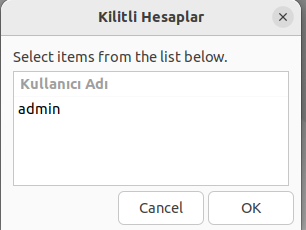
</div>

#### Notlar:
- Kilitlenmiş bir hesabın kilidi açılmadan, o kullanıcı sisteme tekrar giriş yapamaz.
- Bu ekran sadece yönetici erişimi içindir. Kullanıcı rolüyle bu ekran görüntülenemez.
- Kilitlenmiş hesap bilgileri `kilitli_hesaplar.txt` dosyasından alınır.

Bu ekran, yanlış giriş denemeleri sonucunda kilitlenen kullanıcı hesaplarını kolayca görmenizi sağlar ve gerekli yönetim işlemlerini yapmanıza olanak tanır.
### Kullanıcı Yönetimi

Bu ekran, sistemdeki kullanıcıların yönetimi için tasarlanmıştır. **Ana Menü** üzerinden **Kullanıcı Yönetimi** seçeneği seçildiğinde karşınıza gelir. Yalnızca yönetici yetkisine sahip kullanıcılar bu menüyü kullanabilir.

#### Seçenekler:
1. **Yeni Kullanıcı Ekle**:
   - Sisteme yeni bir kullanıcı eklemek için kullanılır.
   - Kullanıcının adı, rolü (yönetici veya kullanıcı), ve şifresi eklenir.
   - Şifreler otomatik olarak MD5 formatında kaydedilir.

2. **Kullanıcıları Listele**:
   - Sistemde kayıtlı tüm kullanıcıları listeler.
   - Kullanıcı bilgileri `kullanici.csv` dosyasından okunur ve gösterilir.

3. **Kullanıcı Güncelle**:
   - Var olan bir kullanıcının bilgilerini (ad, rol veya şifre) güncellemek için kullanılır.

4. **Kullanıcı Silme**:
   - Sistemdeki mevcut bir kullanıcıyı tamamen silmek için kullanılır.
   - Silinen kullanıcı sisteme giriş yapamaz.


<div align="center">
  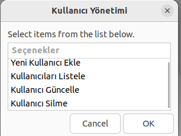
</div>

#### Notlar:
- Her işlem, yetkili kişi tarafından yapılmalıdır. Aksi takdirde "Bu işlem için yetkiniz yok" uyarısı alınır.
- Kullanıcı ekleme, güncelleme ve silme işlemleri sırasında yanlış bilgi girilirse sistem uyarı verir.
- Yapılan tüm işlemler, `log.csv` dosyasına kaydedilir.

Bu ekran, kullanıcı yönetimini kolaylaştırır ve sistemdeki kullanıcıların düzenlenmesine olanak tanır.

### Yeni Kullanıcı Ekle

Bu ekran, sisteme yeni bir kullanıcı eklemek için kullanılır. **Kullanıcı Yönetimi** menüsünden **Yeni Kullanıcı Ekle** seçeneği seçildiğinde karşınıza gelir.

#### Form Alanları:
1. **Ad**:
   - Yeni kullanıcının adı buraya girilir.
   - Örneğin: "Ali".

2. **Rol**:
   - Kullanıcının rolü belirlenir: "yönetici" veya "kullanıcı".
   - Yönetici rolü geniş yetkiler sunarken, kullanıcı rolü sınırlı yetkilere sahiptir.

3. **Şifre**:
   - Kullanıcının giriş yaparken kullanacağı şifre buraya girilir.
   - Şifre, sisteme otomatik olarak **MD5 hash** formatında kaydedilir.


<div align="center">
  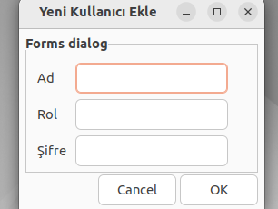
</div>

#### Notlar:
- Kullanıcı adı boş bırakılamaz ve benzersiz olmalıdır (sistemde aynı adla başka bir kullanıcı olmamalıdır).
- Şifre güvenli bir şekilde kaydedilir ve görüntülenmez.
- Eğer bilgiler eksik veya hatalı girilirse, sistem uyarı verir ve kullanıcı eklenmez.
- Kullanıcı ekleme işlemi başarıyla tamamlandıktan sonra işlem `log.csv` dosyasına kaydedilir.

Bu ekran, sisteme yeni kullanıcıların hızlı ve güvenli bir şekilde eklenmesini sağlar.

### Kullanıcı Listesi

Bu ekran, sisteme kayıtlı olan tüm kullanıcıların listesini görüntülemek için kullanılır. **Kullanıcı Yönetimi** menüsünden **Kullanıcıları Listele** seçeneği seçildiğinde karşınıza gelir.

#### Tablo Başlıkları:
1. **kullanici_id**:
   - Her kullanıcıya sistem tarafından otomatik olarak atanan benzersiz bir kimlik numarasıdır.
   - Örneğin: "10".

2. **ad**:
   - Kullanıcının adı.
   - Örneğin: "talhahoca".

3. **rol**:
   - Kullanıcının sistemdeki rolü: "yönetici" veya "kullanıcı".
   - Yönetici daha geniş yetkilere sahiptir, kullanıcı sınırlı yetkilere sahiptir.

4. **sifre**:
   - Kullanıcının şifresi **MD5 hash** formatında güvenli bir şekilde saklanır.
   - Bu format sayesinde şifreler metin olarak görünmez ve daha güvenli bir ortam sağlanır.


<div align="center">
  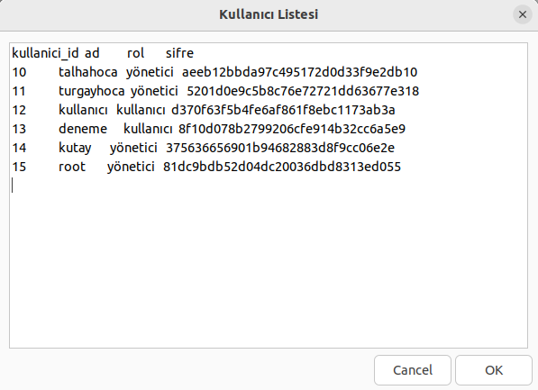
</div>

#### Notlar:
- **Şifreler** yalnızca MD5 formatında görüntülenir; orijinal metin şifreler sistemde saklanmaz.
- Yönetici, kullanıcıların rollerini ve diğer bilgilerini kontrol etmek için bu listeyi inceleyebilir.
- Liste, `kullanici.csv` dosyasından okunur ve güncel bilgileri içerir.

Bu ekran, sistemdeki kullanıcıların detaylı bir listesini sunarak yönetim süreçlerini kolaylaştırır.

### Hata Kayıtları

Bu ekran, sistemde gerçekleşen hataların kaydedildiği listeyi görüntülemek için kullanılır. **Program Yönetimi** menüsünden **Hata Kayıtlarını Görüntüleme** seçeneği seçildiğinde karşınıza gelir.

#### Tablo Başlıkları ve İçerik:
1. **Tarih ve Saat**:
   - Hatanın gerçekleştiği tarih ve saat bilgisi.
   - Örneğin: "2024-12-23 23:56:50".

2. **Hata Türü**:
   - Gerçekleşen hatanın türünü veya açıklamasını belirtir.
   - Örneğin: "Geçersiz stok veya fiyat girildi".

3. **Ek Detaylar**:
   - Hatanın spesifik ayrıntılarını içerir.
   - Örneğin: "Ürün adı veya kategori boşluk içeriyor" ya da "Aynı isimde ürün eklendi".


<div align="center">
  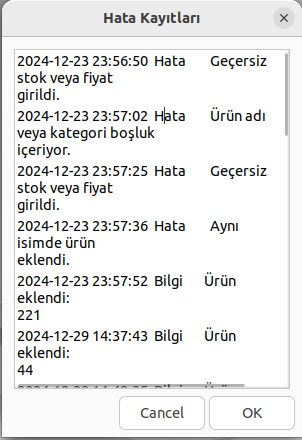
</div>

#### Notlar:
- Bu liste yalnızca hata kayıtlarını görüntülemek içindir, kayıt üzerinde işlem yapılamaz.
- Yönetici, hataların nedenini ve hangi işlemler sırasında oluştuğunu anlamak için bu listeyi inceleyebilir.
- Hatalar kronolojik sıraya göre görüntülenir.

### Giriş Başarılı ve Yetki Uyarısı

Bu iki ekran, kullanıcı giriş işlemleri sırasında ve yetki kontrolü esnasında karşılaşılabilecek mesajları göstermektedir.

---

#### **1. Giriş Başarılı**

- **Ne Zaman Görülür?**
  - Kullanıcı adı ve şifre doğru girildiğinde.
  - Kullanıcıya sistemdeki rolü hakkında bilgi verir: "yönetici" veya "kullanıcı".

- **Amaç:**
  - Kullanıcının başarılı bir şekilde giriş yaptığını ve rolüne göre sistemde hangi yetkilere sahip olduğunu bildirmek.

---

#### **2. Yetki Uyarısı**
  - Kullanıcı, yetkisi olmayan bir işlem yapmak istediğinde bu hata mesajı görüntülenir.
  - Örneğin: "Bu işlem için yetkiniz yok!".

- **Ne Zaman Görülür?**
  - "Kullanıcı" rolündeki bir kişi, sadece "yönetici" yetkisi gerektiren bir işlemi seçtiğinde.
  - Örneğin: Kullanıcı "Ürün Sil" seçeneğine tıklarsa bu hata mesajını alır.

- **Amaç:**
  - Kullanıcıya, seçtiği işlemi gerçekleştirme yetkisinin olmadığını bildirmek.
  - Sistemin erişim kontrol mekanizmasının doğru çalıştığını gösterir.

---


<div align="center">
  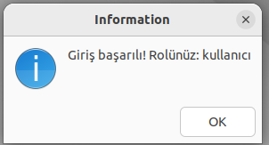
  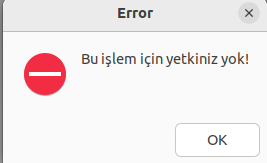
</div>

---

#### **Notlar:**
1. **Giriş Başarılı Mesajı:**
   - Kullanıcının doğru bilgilerle giriş yapması durumunda hemen gösterilir.
   - Kullanıcının sistemdeki rolünü (kullanıcı veya yönetici) net bir şekilde belirtir.

2. **Yetki Uyarısı Mesajı:**
   - Sistem, kullanıcıların yetki seviyelerine göre işlemlerini sınırlar.
   - Kullanıcı rolü ile yetkili olduğu işlemler dışında bir seçeneği kullanmaya çalışırsa bu mesajla karşılaşır.
   - Yönetici bu mesajı almaz çünkü tüm işlemleri gerçekleştirme yetkisine sahiptir.

---

Bu ekranlar, sistemin kullanıcı ve yetki kontrol mekanizmasının düzgün çalıştığını kanıtlar ve kullanıcıların işlem yetkilerini açık bir şekilde iletir.
